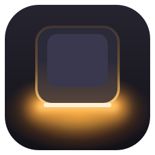
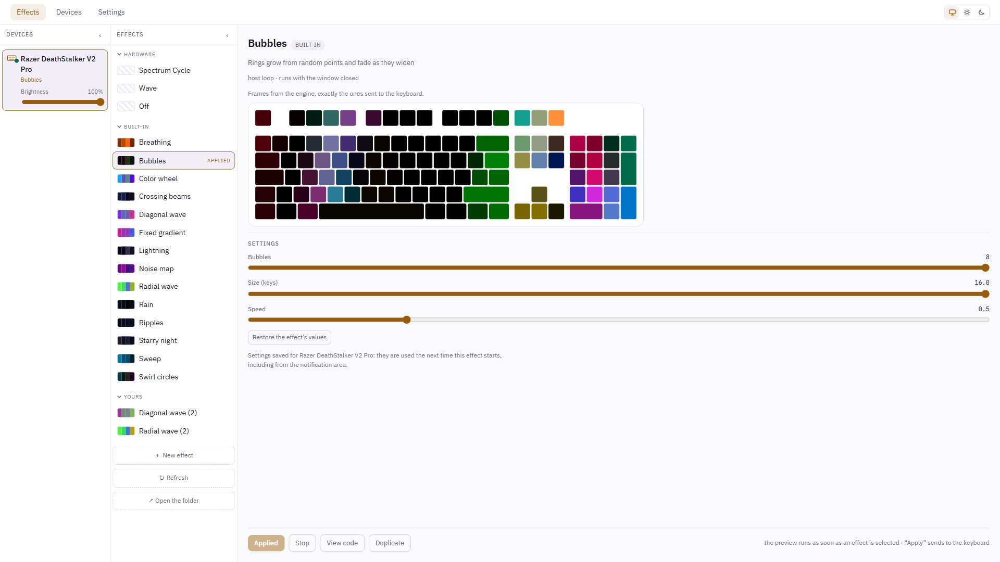

# Candeo

> *candeo*, Latin verb — "I shine, I glow". The root of *candela*,
> the SI unit of luminous intensity.

Lighting control, by talking to the device. No vendor runtime, no background
service, no account: Candeo writes to the device over the HID interface the
system already exposes, and the effects you write keep running with the window
closed.

**[o2csi.github.io/candeo](https://o2csi.github.io/candeo/)**



## What it does

- **Drives the Razer DeathStalker V2 Pro (wired) and the Alienware m18 R1**, its
  keyboard key by key and its lighting zones, along with their own firmware
  effects and brightness. [Devices](https://o2csi.github.io/candeo/devices.html)
- **Twenty-three effects** ship with it: waves, rain, a starry night, a clock,
  scrolling text, ripples from the keys you press, an equalizer and fireworks on
  the beat.
- **Effects are TypeScript files** you write in the app, next to a simulator
  drawing what the keyboard would receive, or in the editor you already use.
- **Rules take over for a while**: the time on the hour, the keyboard dark at
  night. [Rules](https://o2csi.github.io/candeo/automations.html)
- **Your other tools can say what happened**: a script or Home Assistant sends a
  value to a local API, and a rule or a setting follows it.
  [Signals](https://o2csi.github.io/candeo/signals.html)
- **Lights follow your music**, and any setting can follow the sound: a speed
  with the volume, a colour with the bass, a device's brightness with the beat.
  Never the microphone, never recorded.
  [Sound](https://o2csi.github.io/candeo/sound.html)
- **Sends nothing**: no account, no telemetry. In English and French.

## Install

- **[Microsoft Store](https://apps.microsoft.com/detail/9MXFM8QT1X7P)**: signed
  by Microsoft, and updated by the Store.
- **Windows (x64)**, from the [releases](https://github.com/o2csi/candeo/releases):
  `candeo_<version>_x64-setup.exe` installs for your account without
  administrator rights; the `.msi` installs for every account and needs them.
  Not signed yet: SmartScreen warns about an unknown publisher, **More info**,
  then **Run anyway**.
- **winget**, once the manifest is accepted: `winget install candeo`.
- **Linux (x86_64)**: `sudo apt install ./candeo_<version>_amd64.deb` or
  `sudo dnf install ./candeo-<version>-1.x86_64.rpm`. Both install the udev rule
  that gives you access to the device: plug it in again afterwards.

Each release carries a `SHA256SUMS` file: `sha256sum -c SHA256SUMS
--ignore-missing` on Linux, `Get-FileHash <file>` in PowerShell. Installing the
next release over the current one keeps settings and effects.

## Write an effect

An effect receives the device's layout and the time, and paints every key. This
one runs on any keyboard, whatever its size:

```ts
import { bounds, center, defineEffect, hsv } from '@candeo/effects-api'

export default defineEffect({
  description: 'A rainbow sweeping across the keyboard',
  render({ layout, time, frame }) {
    const area = bounds(layout)
    for (const key of layout.keys) {
      const across = (center(key).x - area.x) / area.w
      frame.set(key, hsv(across * 360 - time * 60, 1, 1))
    }
  },
})
```

Yours live in `Documents\candeo\effects`. **[Write an effect](https://o2csi.github.io/candeo/effects.html)**
covers settings people can change, the helpers, and recipes for typing, words,
sound and signals. The shipped effects, in [`packages/effects/`](packages/effects/),
are written against the same API
([`packages/effects-api`](packages/effects-api/src/index.ts)).

## How it is built

The protocol was established **by observing the hardware** (USB captures, then
direct writes and reads checked one by one), and each fact carries the firmware
version and the date it was established: [`docs/protocol/`](docs/protocol/).
Facts about a protocol are not subject to copyright, and surveying them for
interoperability is provided for by **Article L.122-6-1 IV of the French
Intellectual Property Code** (transposing Directive 2009/24/EC, Article 6).

Decisions are written before the code, in [`docs/design/`](docs/design/): the
interface in [`studio.md`](docs/design/studio.md), the engine that runs effects
in a thread outliving the window in
[`effects-runtime.md`](docs/design/effects-runtime.md).

```
candeo/
├── crates/
│   ├── candeo-protocol/   report construction, pure and tested without hardware
│   └── candeo-device/     HID transport and device layouts
├── apps/desktop/          the Tauri application (Vue 3 + TypeScript, Rust in src-tauri)
├── packages/
│   ├── effects/           the shipped effects
│   └── effects-api/       TypeScript types for effect authors
├── packaging/             installers, udev rule, Microsoft Store, winget
├── site/                  o2csi.github.io/candeo
└── docs/                  protocol surveys, commands, design decisions
```

## Development

Stable Rust, Node 22+, pnpm 10+; on Windows, the WebView2 runtime (present on
Windows 11). On Linux, the system packages and the udev rule are in
[`docs/linux.md`](docs/linux.md).

```bash
pnpm install
pnpm tauri dev                  # run the application
pnpm check                      # clippy and the Rust tests
cargo test -p candeo-protocol   # protocol tests, no hardware needed
```

[`AGENTS.md`](AGENTS.md) holds the rules for changing the repository, the checks
CI runs included.

The project was developed in a private repository before being published. Its
issues and pull requests were recreated here **under their original numbers**,
so `#N` references in commits, code and docs lead to the right place; a pull
request appears as a closed issue labelled `PR archivée` that links to its
commit on `main`.

## Privacy

Candeo collects nothing, sends nothing, and has no accounts: see
[`PRIVACY.md`](PRIVACY.md). The one request it can make is asking GitHub whether
a newer version exists, which Settings turns off.

## License

Distributed under the terms of the GNU General Public License, **version 3
only** (`GPL-3.0-only`). See [`LICENSE`](LICENSE).
