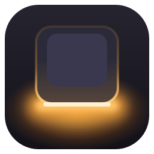
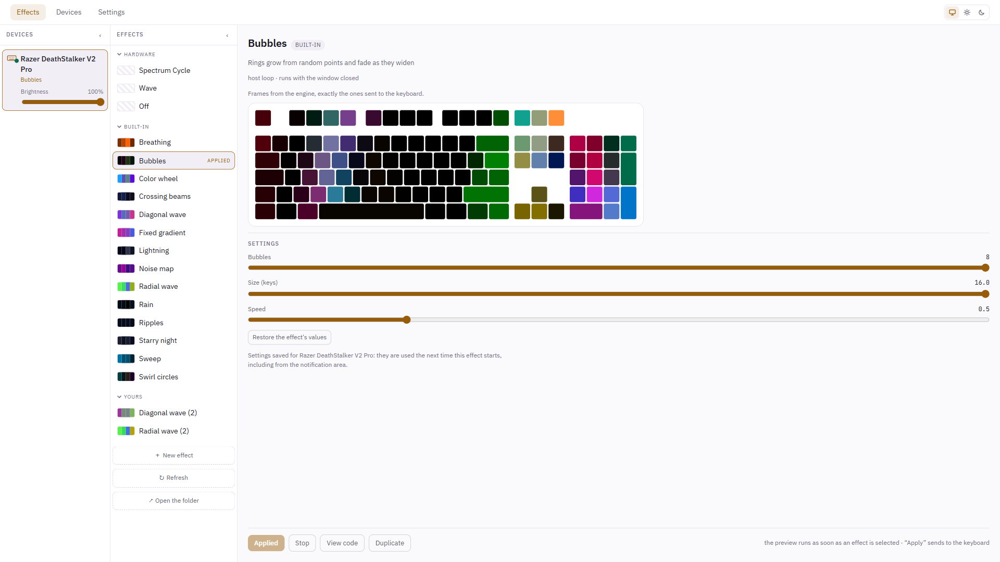

# Candeo

**Your keyboard's lights, your way.**

One small app instead of the maker's lighting software. Pick an effect, make the
lights follow your music, or let them tell you when something happens. No
account, no extra services to install, nothing sent anywhere.

**[o2csi.github.io/candeo](https://o2csi.github.io/candeo/)** ·
**[Get it from the Microsoft Store](https://apps.microsoft.com/detail/9MXFM8QT1X7P)**



## Get started

1. **Install Candeo** from the
   [Microsoft Store](https://apps.microsoft.com/detail/9MXFM8QT1X7P) — or
   [another way](https://o2csi.github.io/candeo/install.html): the signed
   package to download, winget, Linux packages.
2. **Open Devices** and click *Control* next to your keyboard.
3. **Pick an effect** and *Apply* it. It keeps running when you close the window.

## What it does

- **Twenty-four effects, ready to go** — waves, rain, a starry night, a clock,
  scrolling text, ripples from the keys you press, fireworks on the beat. Tune
  each one while you watch it; your keyboard's own built-in effects are there
  too.
- **Lights that dance to your music** — and any effect can follow the sound:
  faster when it gets loud, redder with the bass. Never your microphone, never
  recorded. [Sound](https://o2csi.github.io/candeo/sound.html)
- **Lights that tell you things** — the time on the hour, the keyboard dark at
  night, the keyboard red when a build fails.
  [Rules](https://o2csi.github.io/candeo/automations.html) ·
  [Signals](https://o2csi.github.io/candeo/signals.html)
- **Your games** — your health, ammo, flashes and the bomb in Counter-Strike 2,
  your hero's health, mana and stuns in Dota 2, connected in one click. [Games](https://o2csi.github.io/candeo/games.html)
- **Your devices** — the Razer DeathStalker V2 Pro and the Alienware m18 R1,
  keyboard and lighting zones, and more Razer keyboards to try.
  [Devices](https://o2csi.github.io/candeo/devices.html)
- **Sends nothing** — no account, no telemetry. In English and French.

## Make it yours

Everything Candeo lights with is a file you can open, write and share:

- **[Write an effect](https://o2csi.github.io/candeo/effects.html)** — a short
  TypeScript file, previewed on your keyboard as you type.
- **[Describe a device](https://o2csi.github.io/candeo/devices-guide.html)** —
  teach Candeo a new device with a JSON file, no code and no rebuild.
- **[Send signals](https://o2csi.github.io/candeo/signals.html)** — let a
  script, a build or Home Assistant light the keyboard.

This effect is a rainbow sweeping across any keyboard:

```ts
import { bounds, center, defineEffect, hsv } from '@candeo/effects-api'

export default defineEffect({
  description: 'A rainbow sweeping across the keyboard',
  render({ layout, time, frame }) {
    const area = bounds(layout)
    for (const key of layout.keys) {
      const across = (center(key).x - area.x) / area.w
      frame.set(key, hsv(across * 360 - time * 60, 1, 1))
    }
  },
})
```

More in **[Build on Candeo](https://o2csi.github.io/candeo/sdk.html)**: where
your files live, the editor, the references.

## Contribute

Candeo is a [Tauri](https://tauri.app) application: Rust underneath, Vue 3 and
TypeScript for the window. With stable Rust, Node 22+ and pnpm 10+ — and on
Linux the packages in [`docs/linux.md`](docs/linux.md):

```bash
pnpm install
pnpm tauri dev
```

- [`AGENTS.md`](AGENTS.md) — the rules for changing the repository, and the
  checks CI runs.
- [`docs/design/`](docs/design/) — decisions, written before the code.
- [`docs/protocol/`](docs/protocol/) — the device protocols, each fact with the
  firmware and the date it was established.
- [How Candeo is built](https://o2csi.github.io/candeo/sdk.html#how-candeo-is-built),
  including the legal basis for surveying protocols.

The project was developed in a private repository before being published. Its
issues and pull requests were recreated here **under their original numbers**,
so `#N` references in commits, code and docs lead to the right place.

## Privacy

Candeo collects nothing, sends nothing, and has no accounts: see
[`PRIVACY.md`](PRIVACY.md). The one request it can make is asking GitHub whether
a newer version exists, which Settings turns off.

## License

Distributed under the terms of the GNU General Public License, **version 3
only** (`GPL-3.0-only`). See [`LICENSE`](LICENSE).
